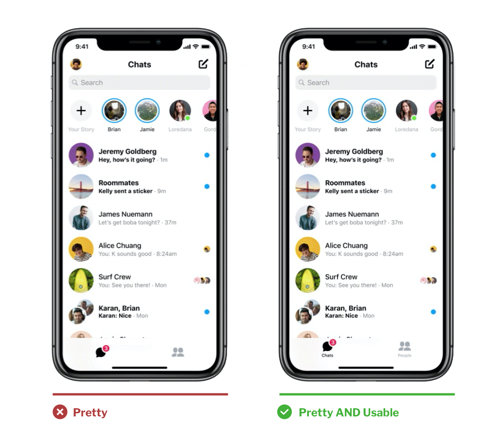

## Beautiful is Best?

A phenomenon most of us are familiar with, even if we don't know it by name:  
**good looking people have an unfair advantage in life.**

The [beauty premium phenomenon](https://en.wikipedia.org/wiki/Physical_attractiveness_stereotype#Beauty_premium_phenomenon) states that we expect good-looking people to be "better, smarter, more successful, more important, and more valuable."

Likewise, in 1995 when researchers [were studying ATM UIs](https://www.researchgate.net/publication/290957555_Apparent_usability_vs_inherent_usability_experimental_analysis_on_the_determinants_of_the_apparent_usability), they noticed that people expected more of and were more forgiving of good-looking interfaces.

Sound familiar?

If you replace "UIs" with "people", you basically have what the researchers discovered—the [aesthetic-usability effect](https://www.nngroup.com/articles/aesthetic-usability-effect/). It states that we have a tendency to perceive attractive UIs as more usable and expect that they'll work better—even if that isn't true.

## Rationalizing Pretty

It seems almost every UX designer (including yours truly) has cited this aesthetic-usability effect at one point or another to justify a design decision that makes the design better-looking at the expense of usability or clarity.

And you know what? They're almost always wrong.

Michal Malewicz says it best in his [tell it like it is article](https://uxdesign.cc/ux-has-pretty-bad-ux-fd2702e5c22a):

> “UX has a hole in it. It’s called UI and it’s quite bad. This is often because a large part of “UX Designers” can’t design. There. I said it.”

It takes some skill to make a design pretty, but it takes a lot more skill to make a design pretty _and_ usable.

The majority of job postings ask UX designers to do both UX & UI design, despite most not being remotely qualified to do both.

Not that I believe we should only have specialists—quite the contrary. But I don't believe we should expect designers to do something that they haven't shown they're capable of doing.

## A Dumb Dichotomy

Designers citing this principle in defense of their "pretty" designs like to come up with this dumb dichotomy: _either we make it pretty OR we make it usable._

Spoiler: you can make something pretty and usable.

Facebook Messenger recently redesigned its mobile app. Even though they simplified their app significantly, one thing they added was labels to their bottom tab bars. Is it cleaner without labels? Certainly. But adding labels doesn't all of a sudden make it an ugly design.

## No One Knows What Your Dam Icon Means

Unlabeled icons are probably the number one reason a designer will bring up the aesthetic-usability principle. You can add a label to your dam icon in a way that looks good **and** people will actually be able to understand that the icon means “dam” and not "bacon dispenser."

We learned this was a bad idea when Flash became popular (remember [mystery meat navigation?](http://www.webpagesthatsuck.com/mysterymeatnavigation.html)), but we seem to keep making the same mistakes over and over.

Unlike art, there's only one correct design interpretation, and it's your job as a designer to make that crystal clear.

There are certainly instances where you need to make some tradeoffs on aesthetics to make a design more usable, but if the rest of the UI is designed well, then it's still going to get the aesthetic-usability effect bump. It just won't look perfect. But really, how often is anything perfect?

Even good-looking people have a few flaws.
