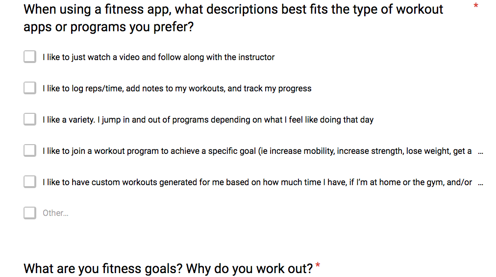
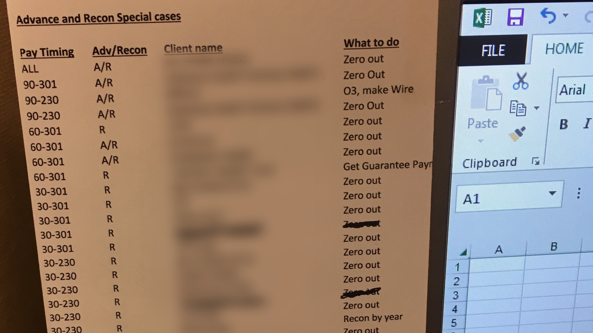
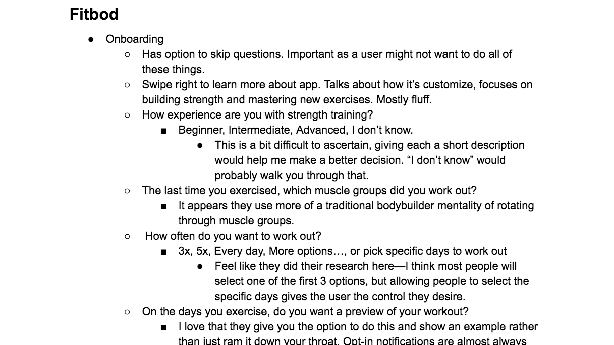
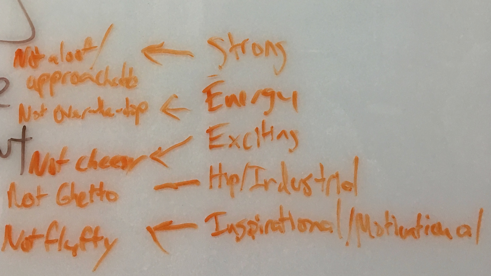
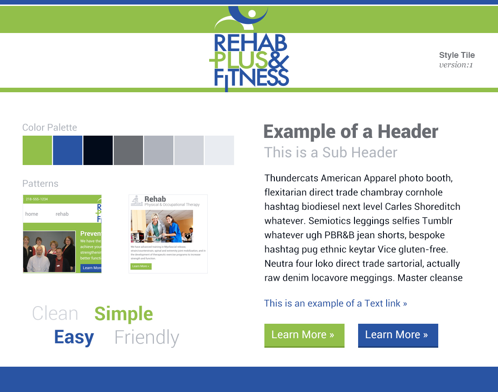
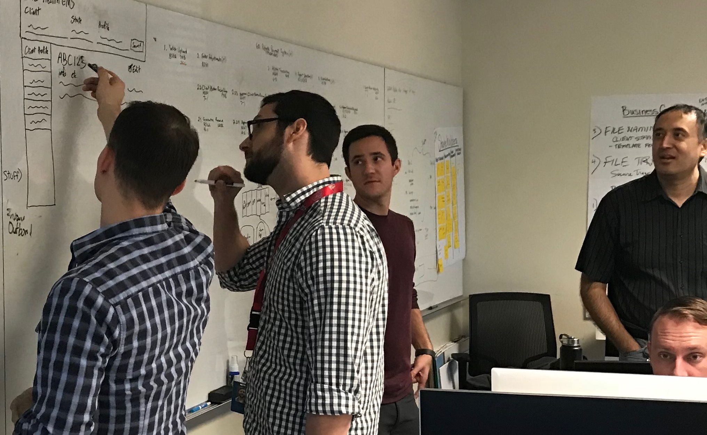
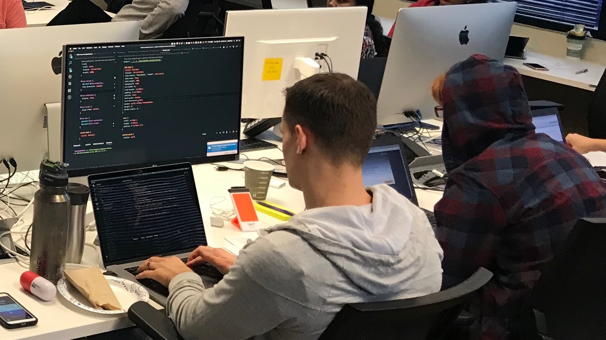

Designers love wasting time.

The problem is, they just don't know that that's what they're doing. They love to spend numerous hours running design exercises and creating design artifacts without actually getting any closer to a solution.

That's why I tend to follow more of a [Lean UX model](https://www.scaledagileframework.com/lean-ux/). This allows me to get to code as quickly as possible. If there's a well-established code component library, I'll sometimes even design in code for simpler pages. I do this because as the Lean UX model espouses, it's impossible to get everything right up front, so it's better to get things out there and evaluate design hypotheses on a real interface.

Every project is different, but below is generally the process I follow.

### 1. Heuristic Evaluation

To help familiarize myself with an existing product, I do a deep dive on the site and note where I find usability issues or opportunities for improvement. I like doing these without ever having used the site or having much knowledge of the business as it's much easier to identify confusing or unintuitive things.

### 2. Stakeholder Interviews

I conduct interviews with stakeholders to make sure I understand their goals and vision for the app or website. Too often, designers will make a lot of assumptions, and jump right into designs. It's very important to talk to all stakeholders as they'll often have very different goals and ideas, so getting alignment among stakeholders is critical before moving forward.

### 3. User Surveys and User Interviews

I try to do user surveys and user interviews, so I’m able to gather both quantitative and qualitative data to understand what problems users are facing, what their goals are, and to make sure there’s alignment with what stakeholders think their users want. Oftentimes, stakeholders will want something that users don't actually want, so catching this early is critical to a successful project—many startups learn this the hard way.

### 4. User Shadowing (a.k.a. Field Studies, Contextual Inquiries)

It's one thing to ask users what their current issues are and what they'd like to see changed or fixed, but observing them will give you the best results. During a shadow session, I'll ask them to verbalize what they're doing and I'll interject when I'd like to understand the rationale or context for what they're doing. Observing users in their natural environment is crucial to make them as comfortable as possible, but it's here where you'll get to observe workarounds that users have developed to cope with poor usability or lack of functionality. Users will often create cheat sheets or print something out as a workaround. Users get so used to their workarounds, that they don't even realize that these things were even problems to begin with.

### 5. Competitive Analysis

I run through competitors’ apps or websites to get a good picture of the landscape. I find things that competitors do well that I think we can incorporate, discover things they don't do well that we can capitalize on, and I'll also find holes or niches in the landscape where I believe we can gain a competitive advantage. I present my findings and recommendations and we update our strategy accordingly.

### 6. Brand Personality Assessment

I do some branding exercises with stakeholders that are largely based on exercises from Aaron Walter's book, [Designing with Personality](https://abookapart.com/products/designing-for-emotion). The goal of the exercises is to make sure that the current/future branding lines up with the type of personality that stakeholders are trying to project to their users or customers. This will help guide the voice and tone that I use for writing copy and selecting or updating the color scheme for the brand. This helps stakeholders understand that branding is a goal to control how you're perceived by your users. Putting these things down in writing allows everyone to point back to what the goal is when we discuss things like color schemes, copy, and the overall brand. This greatly helps reduce opinion-based debates about aesthetics when you can objectively ask if their opinion lines up with the goals for branding.

### 7. Style Tiles

When working on creating a new brand or redesign, rather then waste a large amount of time building full-size mockups of different design aesthetics, I use [Style Tiles](http://styletil.es/) which show a small number of UI elements without any layout. I then present the one that I feel that represents their brand personality the best before proceeding further.

### 8. Sketching and/or Wireframes

Depending on the project, I'll start sketching out some ideas by myself or with other designers. If the stakeholders are willing to be more involved in the process, I like to do exercises like [Crazy Eights](https://thoughtbot.com/product-design-sprint/guide/diverge/crazy-eights) which help stakeholders get involved in the design process through them generating design ideas that I or my fellow designers wouldn't be able to come up with on our own. Usually sketches are enough, but sometimes I'll create wireframes or lo-fidelity mockups to help solidify how we lay things out on each screen.

### 9. Hi-fidelity Mockups

![Hi-Fidelity mockup from [24]7.ai](hifidelity-mockup.jpg)
I start with designing a simple mockup in Sketch and gather feedback to ensure that the branding matches expectations. Throughout the mockup process, I’m sharing and gathering feedback from stakeholders to ensure we’re covering all of the problems we’re trying to solve and adjusting the mockups as needed.

### 10. User Testing with Clickable Prototype

To make sure we don't waste time developing designs that aren't intuitive, I'll create a clickable prototype using the hi-fidelity mockups with tools like InVision or Sketch Prototype. I test the clickable prototype with at least one internal employee or stakeholder to ensure the user test doesn’t have any issues itself and then try to test with at least 5 users to make sure the designs are intuitive to users.

### 11. HTML & CSS

Depending on where the other developers are at, I’ll create a skeleton (code with no backend) ahead of the other developers or I’ll have them get the logic/backend working and I’ll come in behind them and flesh out the styles. I've been the team lead for HTML & CSS with many teams and I also have experience working with Javascript, React, Angular 2+, and jQuery, so I'm able to take the designs quite a ways before handing it off to other developers.

### 12. User Testing with Working Code

There's nothing worse than launching a product to only find out something doesn't quite work right. Testing with a clickable prototype should catch a lot of the more obvious issues, but since it isn't the real thing, it isn't possible to catch everything. I follow the same process for creating user tests that I did with clickable prototypes, but these tests are typically a bit more extensive since it's easier to test an entire workflow with working code.

### 13. Monitor Analytics

To make sure the design is a success and doesn’t have any major issues, I add tracking to all actions and monitor them after launch. I also monitor actual user sessions with a tool like FullStory which gives you a video of users’ sessions. This greatly helps expose bugs and UX issues that users generally don’t report.

### 14. 🎉 Celebrate on a job well done!
